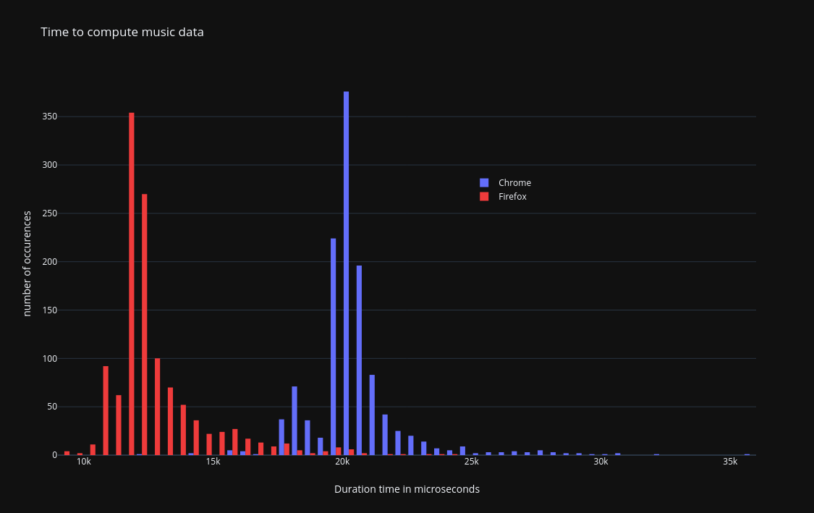

# Optimisation #1: Compute music data less often

OpenAL and fluidsynth internals are nowhere near my core strengths, therefore the following was found via some
trial and error method.

When playing music, the program was doing the following:

```
On keyboard event (i.e. when pressing or releasing piano keys):
  For each key pressed:
    - tell fluidsynth that key just got pressed
    - ask fluidsynth to compute the new music data in a buffer
    - send that buffer to openAL

  For each key released:
    - tell fluidsynth that key just got un-pressed
    - ask fluidsynth to compute the new music data in a buffer
    - send that buffer to openAL

Wait for the next event.
```

One attempt here was to restructure this code to only ask fluidsynth to compute the music data once per music
event, in other words, changing the code to the following:

```
On keyboard event (i.e. when pressing or releasing piano keys):
  For each key pressed:
    - tell fluidsynth that key just got pressed

  For each key released:
    - tell fluidsynth that key just got un-pressed

  ask fluidsynth to compute the new music data in a buffer
  send that buffer to openAL

Wait for the next event.
```

An important thing to do when trying these possible optimisations is to always ensure that the software still
works. A lot of my attempts resulted in having no music getting played at all, or sometimes being played but
feeling jerky. I was concerned that this optimisation could lead to only hearing the music from the last key
instead of all of them. Before looking into performance improvements, correctness need to be maintained.

On this attempt, if no measurable timing difference would appear, we would know that computing music is linear
to the number of key changes. If instead things would become about `n` times faster when there are `n` keys
pressed and released, it would mean filling the buffer takes the same amount of time regardless of the number
of key changes, and therefore should only be done as little times as strictly necessary.

Measuring this change showed that we were on the side of `n` times faster. This change alone was enough to
make music playable at the right speed. With this change, a music event takes about 12ms on firefox, and 20
on chrome. Of course the exact computation times change based on several factors, e.g. number of key changes
but also CPU thermal throtting or thread scheduling, of which I have little to no control over. Those numbers
here are only a ballpark figure, which leads to the next issue: music correctness.

After this optimisation, the timing for computation was as follow on firefox and chrome.



On this graph, each column represent a duration window of half a millisecond.  We can see that firefox manages
to compute the data most of time in less than 15 milliseconds. The most common duration being between 11.5 and
12 ms.

For chrome, the computation usually takes between 20 and 20.5 milliseconds.

| Durations in ms | min  | average | stddev | max  |
|-----------------|------|---------|--------|------|
| firefox         | 9.0  | 12.7    | 1.3    | 24.0 |
| chrome          | 12.1 | 20.5    | 1.0    | 35.8 |

This graph was generated by playing `Etude as dur -op25 - 01` on a 2011 laptop using firefox 102 and chromium
103 on linux with a kernel version 5.18.
