# Optimisation: precompute the following music buffer

In order to fix the variance issue, one has to ensure that the time between the moment music has to played,
and when it is actually played is always the same. Ideally it has to also be minimal.

With the table we got after measuring computing time on chrome and firefox we see that the time to compute
music can cary by as much as 15ms for firefox and 23ms for chrome (`max - min`).

In other words, we can have the following situations:

The best way to view this image is to right click on it, and open in a new tab.

On this graph, we see that two red bars do not have the same length. The top one represent the time passed
between the two events, in other words when the music should be played, whereas the second one shows how much
time actually passed and when exactly the music was played.

On this example, the second event should be played exactly 96ms after the first one, but is actually played
113ms after.  This is due to the fact that computing the music data for the second event took longer than
computing the data for the first one, leading to playing the music too late. In the opposite case where
computing the music for the first event would be slower than computing the data for the second, we would play
the music too early.

The solution to avoid this problem relies on the fact that it usually takes less time to compute the music
data than the time we have to wait before playing the next event. Remember that we deal with music sheets, not
random events, we can always look ahead to know what is coming.  The software takes advantage of this to
pre-compute the next buffer that will be used. Consequently, as soon as an event arrives, the relevant music
is already calculated and the software simply tells openAL to play that buffer, then the software uses its
available timeslice to compute the data of the next event.

After this change, the graph of event processing looks like the following;

As can be seen, now the two red bars have the same lengths with the added benefit that they are much closer to
each others. The difference in computation time of successive events are now absorbed in the waiting time,
instead of impacting the moment the music gets played.
