# Variance in waiting time between events:

As a consequence of the time it takes to compute music data there is a significant delay (of at least 9ms)
between the moment some music shall be played, and when it actually is. This per-se is not so much of a
problem. As a user this issue only manifests itself as a latency of a few milliseconds between clicking the play button,
and the song actually starting. And since this latency is below 40milliseconds, a user will barely notice
anything.

A bigger issue though, is that the compute time directly impacts the moment music is played, and this compute time varies
for each event. The consequence is that events are therefore not played at the correct tempo.

Let's consider the following case:

This image is best viewed when right clicking on it and selecting "open image in new tab"

On this image, the two small rectangles on the first line represent the moment when the music should be
played.  The small red rectangles on the third line shows when they are actually played.  Here we can visually
see that the distance between the two "play music" boxes is not the same as the one between the two events.

The two music events should be played 96ms apart, but here they are played `96 - 35 + 12 = 73`ms appart, a
whooping 23ms too early! 23 ms is a worst case based on the data empirically collected. One important point is
that since we have no control over this time discrepency, it is possible that one note is played too early and
the next one too late, or the opposite.

If we consider that the discrepency can go as high as 23ms, in the case of three quarter notes having to be played
every 96ms, we can get a case of having the second one played 73ms after the first one instead of 96ms, and then the
third one being played 119ms after the second one. This is not just playing the song too fast or too slow, _it does
not even respect the tempo!_
